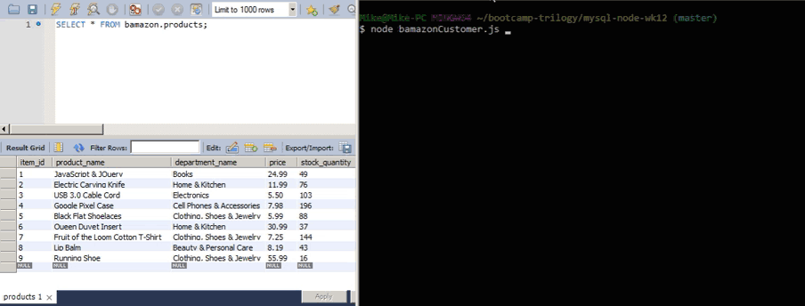

# HW - {mysql-node-wk12}

## Use the prompt to tell the Bamazon store the ID of the product you would like to purchase and quntity desired. You will then be given a total price for your order.

## Requirements
- Use Node.js to create a CLI shop environment
- Create MySQL databse with .sql schema
- Query databse with SELECT and change data with UPDATE

## Technologies Used
- JavaScript for taking in parameters and returning data
- Node.js for CLI creation, NPM packages, and queries
- MySQL for database

## Code Explanation
Node.js and NPM packages prompt the user to select MySQL database rows and store specific user selected data in global variables. productSearch function returns the database query, qtyDesired function prompts the user to input an integer, updateProduct function sets new values in the MySQL database with updated global variable data from all the previous functions. shoppingTotal function runs last to multiply new var integers in console.log, displaying a total price amount to the user. 
